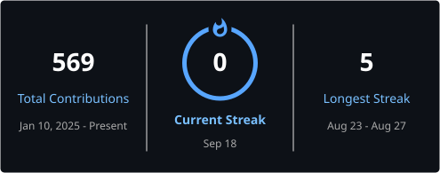

  <picture>
    <source media="(prefers-color-scheme: dark)" srcset="header-dark.png">
    <source media="(prefers-color-scheme: light)" srcset="header-light.png">
    
  </picture>

<h1 align="center">Hi, I'm Bhaskar 👋</h1>

  <b>Data Analyst | SQL | Python | Tableau | Power BI</b>

  I build analytics dashboards and data-driven projects that help teams
  understand performance, uncover trends, and make better decisions.

---

## 👨‍💻 What I Build

I build **data analytics and business intelligence projects** for teams that need to turn raw data into clear, useful insights.

My work focuses on:

- 📊 **Business dashboards** for tracking KPIs, trends, and performance
- 🧮 **SQL analysis** for answering business questions and finding patterns
- 🐍 **Python-based analysis** for data cleaning, preparation, and exploration
- 📈 **Tableau & Power BI reporting** for interactive decision support
- 🔎 **Exploratory analysis** to identify trends, opportunities, and problems

I care about more than making charts look good. The goal is to make the data **useful for decisions**.

  

---

## 🛠️ Main Tech Stack

- **SQL** — querying, aggregation, joins, and business analysis
- **Python** — Pandas, NumPy, data cleaning, and exploratory analysis
- **Tableau** — interactive dashboards and data storytelling
- **Power BI** — business intelligence and KPI reporting
- **Excel** — analysis, reporting, and data preparation
- **MySQL** — relational database querying
- **Git & GitHub** — version control and project development

---

## 📊 Selected Projects

### 👥 HR Analytics Dashboard

A workforce analytics dashboard for HR and business teams to monitor headcount, hiring, terminations, compensation, performance, and workforce distribution in one place.

**Built with:** Tableau · Python · Pandas · NumPy

**Use case:** Workforce planning, HR reporting, and management decision support.

[View Project →](https://github.com/bhaskar-nb/hr-dashboard)

---

### 🎬 Amazon Prime Content Intelligence Dashboard

A content analytics dashboard for exploring catalog mix, genres, ratings, release trends, and geographic distribution to identify patterns in a streaming content library.

**Built with:** Tableau

**Use case:** Content analysis, catalog comparison, and trend discovery.

[View Project →](https://github.com/bhaskar-nb/amazon-prime-dashboard)

---

### ⚡ Electric Vehicle Registration Analysis

An EV registration analysis dashboard for exploring trends, manufacturer share, vehicle mix, geographic concentration, and electric range across the available dataset.

**Built with:** Tableau

**Use case:** EV adoption analysis, manufacturer comparison, and geographic trend analysis.

[View Project →](https://github.com/bhaskar-nb/ev-dashboard)

---

### 🌍 Global Disaster Analysis

Analyzed **15,090 disaster events** to explore human impact, affected populations, and global disaster patterns.

**Built with:** Tableau · Data Analysis

**Use case:** Understanding disaster trends, impact, and geographic patterns.

[View Project →](https://github.com/bhaskar-nb/disaster-dashboard)

---

  

---

## 📈 GitHub Analytics

  

  

---

## 🐍 Contribution Graph

  

---

## 📬 Contact

If you're looking for someone who can turn data into **clear analysis, useful dashboards, and actionable insights**, I'd be happy to connect.

**Email:** bn7740401@gmail.com

  <b>Data → Insights → Decisions</b>

